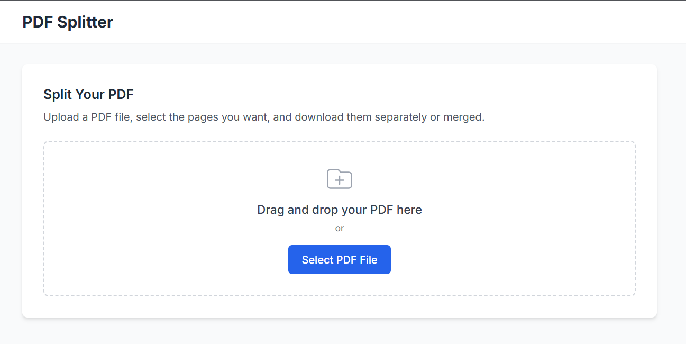

# ✂️ Free PDF Splitter — Fast. Simple. Effective.

Break free from bulky PDF files and split documents like a pro. ⚡

Whether you're managing contracts, separating chapters, or prepping handouts, this tool gives you full control — **no software installation, no fuss.**

<p align="center">
  <a href="https://free-pdf-splitter.netlify.app/" target="_blank">
    
  </a>
</p>

<p align="center">
  <a href="https://www.buymeacoffee.com/rahul.sharma.alx" target="_blank">
    
  </a>
</p>

---

## 🚀 Features

* ✂️ **Split PDFs Instantly**: Extract specific pages or split every page into a separate file.
* 📁 **Drag & Drop Simplicity**: Just drop your file and split in seconds.
* 🔐 **Privacy Focused**: Everything runs in your browser. Your files are never uploaded.
* ⚡ **Blazing Fast**: Powered by pure client-side JavaScript for near-instant performance.
* 🧭 **No Limits, No Watermarks**: 100% free, no hidden restrictions.
* 💻 **Works on All Devices**: Desktop, tablet, or mobile — split on the go.

---

## 🔗 Live Demo

👉 [Use the PDF Splitter Now](https://free-pdf-splitter.netlify.app/) — It’s fast, free, and doesn’t require sign-up!

---

## ⚙️ Getting Started (Dev Mode)

1. **Clone the repository**

```bash
git clone https://github.com/rahul-sharma-alx/pdf-splitter.git
cd pdf-splitter
```

2. **Install dependencies**

```bash
npm install
```

3. **Start development server**

```bash
npm run dev
```

Open `http://localhost:5173` in your browser.

---

## 📦 Deployment

Deploy anywhere in seconds:

* 🚀 [Netlify](https://www.netlify.com)
* 🚀 [Vercel](https://vercel.com)
* 🚀 GitHub Pages

Built with [Vite](https://vitejs.dev) + React for maximum speed.

---

## 📄 License

Licensed under the [MIT License](LICENSE). Use it freely, modify it confidently.

---

## 🙌 Contributing

Got a feature idea or found a bug? Contributions are always welcome!

1. Fork the repo
2. Create your feature branch
3. Make your changes
4. Open a PR

Let’s make PDF splitting easier for everyone. 🤝

---

## ✨ Author

Crafted with care by [Rahul Sharma](https://github.com/rahul-sharma-alx)

<p align="center">
  <a href="https://www.buymeacoffee.com/rahul.sharma.alx" target="_blank">
    
  </a>
</p>
